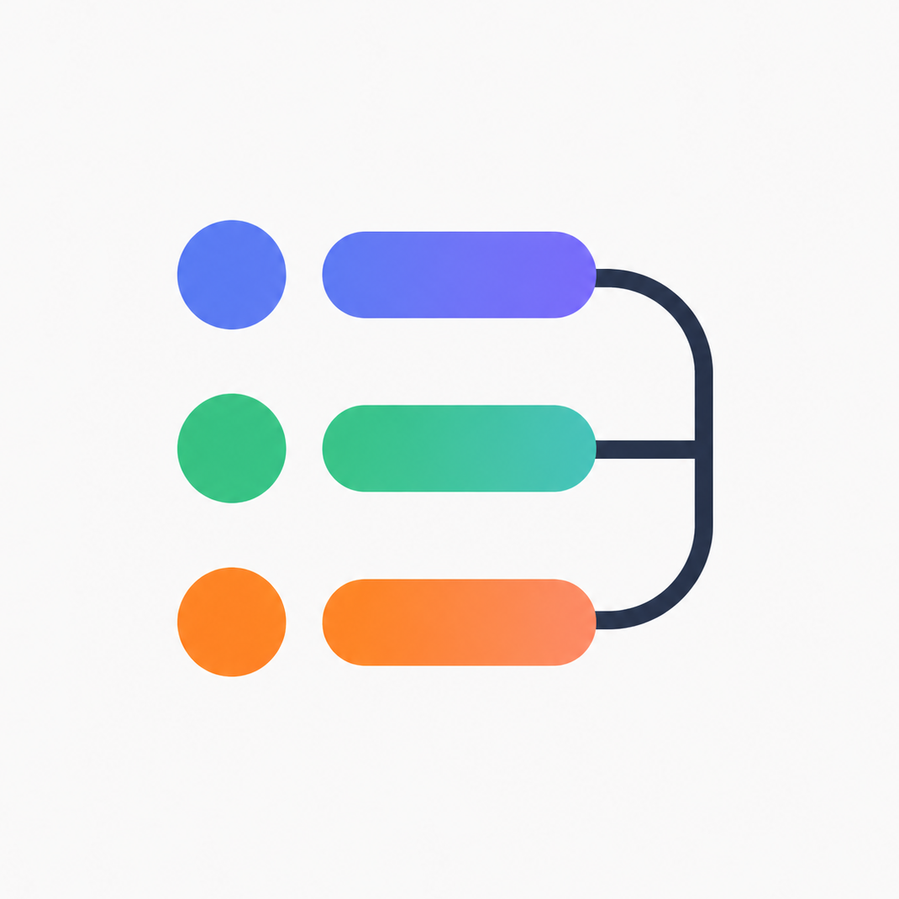
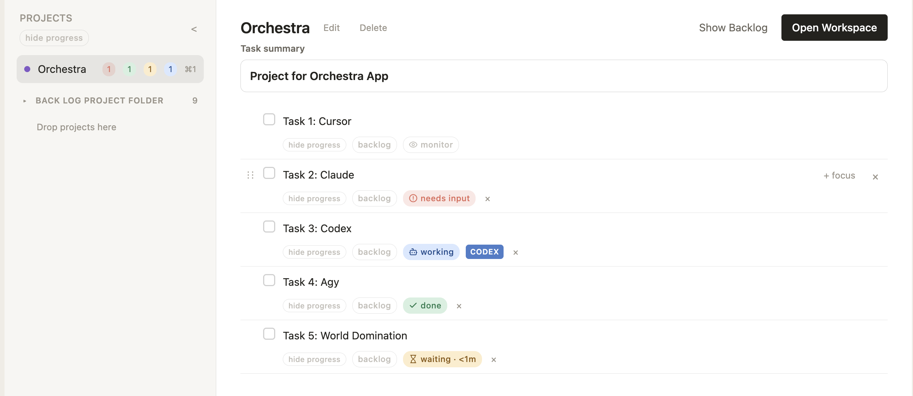
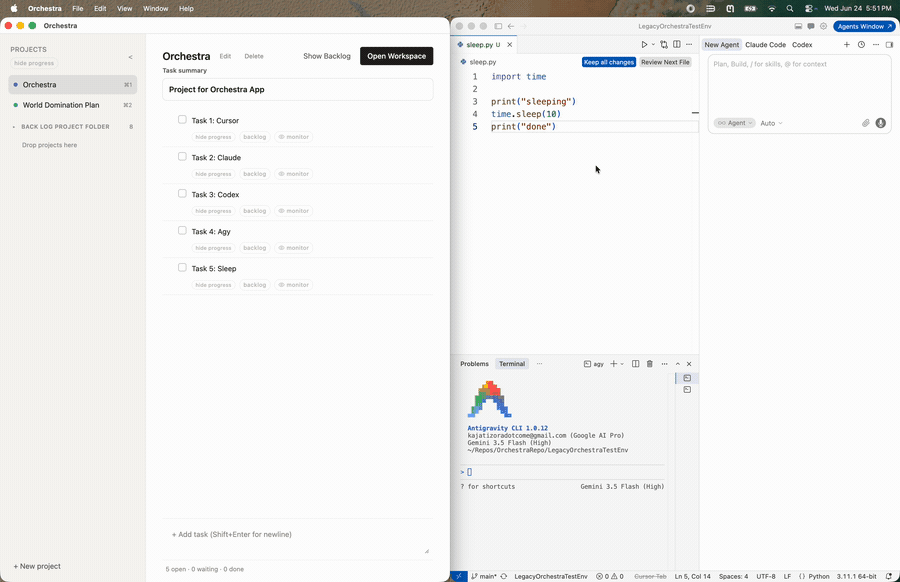
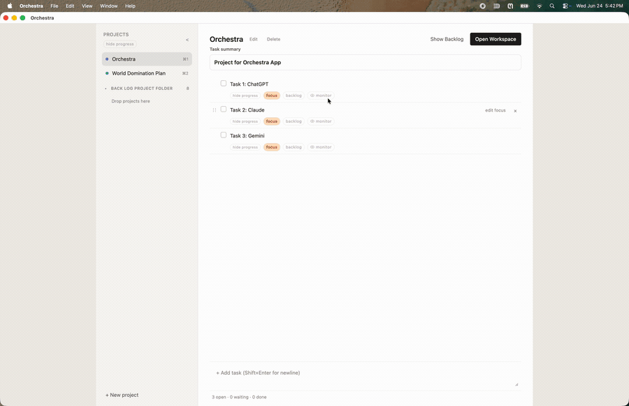
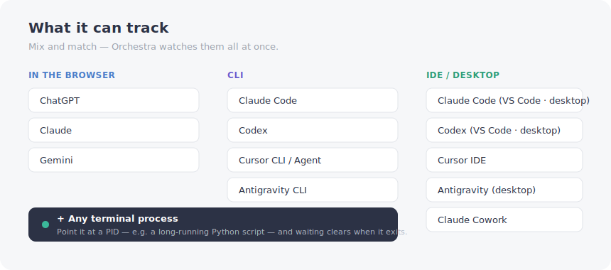
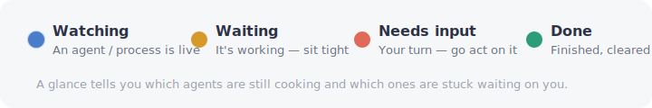
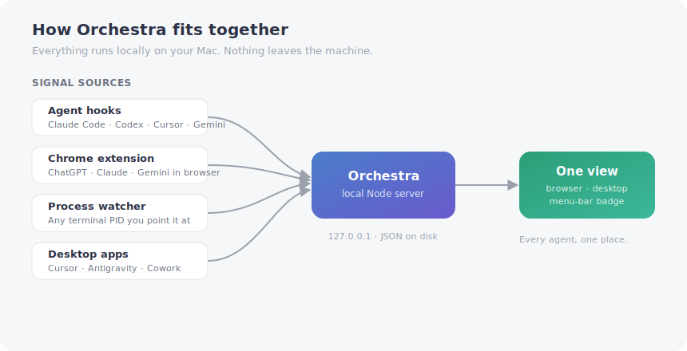

<div align="center">



# Orchestra

### One place to keep track of every AI agent you've got running — across ChatGPT, Claude, Codex, Gemini, Cursor, Antigravity, Cowork, and even plain terminal processes.

<br />



<sub>*(Drop your own screenshot at `assets/screenshots/hero.png` — see [Screenshots](#a-note-on-the-screenshots).)*</sub>

</div>

<br />

## Why I built this

I made Orchestra for myself.

The problem: I kept losing track of what my agents were doing. Even on a *single* platform it got hard — and I'm usually running several at once across different tools. I never liked sitting around watching an agent grind, so I'd kick one off and go start something else. But the context-switching killed me. Every time I came back to an agent I'd lose a minute just reconstructing *what was this one even doing, and what do I need to do next?*

So I built one place to answer exactly that. Glance at it and you can see: this agent is on this task, it's still working, that one's waiting on me — go deal with it. That's the whole idea.

> [!NOTE]
> **This is a personal tool I'm putting out there, not a polished product launch.** It works, and I use it daily, but I built it for me, so there are definitely bugs and rough edges. I'm sharing it because other people wrestle with the same problem — so use it, fork it, break it, rip out the parts you like. No promises, no support guarantees. If it's useful to you, great.

## A note on cost

There's a money angle too. Aggregator platforms are great — one place, every frontier model — but you're usually paying metered **API rates**, which add up fast if you code a lot. Going direct to the model companies on flat **subscriptions** is often dramatically cheaper. Two $20 subscriptions to two different providers can come in well under one $60 aggregator bill, *and* you get to sample whatever each company is shipping at the cutting edge instead of betting on one.

The catch has always been juggling all those separate tools. That's the friction Orchestra is meant to kill: spread your work across whatever's cheapest and best, and still have one place that knows what every agent is doing.

## What it looks like in action

Each clip is the same app watching a different surface. They're sped up a touch so you can see a full loop quickly.

### CLI agents


### Desktop apps


### Inside the IDE — *and a live terminal process*

This one also shows Orchestra tracking a plain terminal process: I kick off a small Python script and Orchestra watches it, clearing the task from **waiting** the moment the script exits. Same mechanism works for any long-running command.



### In the browser



## What it can track

The core feature is following agents **across platforms** so you don't have to keep a dozen windows in your head.



In words, that's:

- **In the browser** — ChatGPT, Claude, and Gemini (via the [Chrome extension](#the-chrome-extension))
- **CLI** — Claude Code, Codex, Cursor CLI / agent window, Antigravity CLI
- **IDE / desktop** — Claude Code (VS Code plugin + desktop app), Codex (VS Code plugin + desktop app), Cursor IDE, Antigravity (desktop), Claude Cowork
- **Any terminal process** — point it at a PID (like a long-running Python script) and the task clears when the process exits

## The status system

The point is that one glance tells you where everything stands.



## Quick start

**You'll need:** macOS and [Node.js](https://nodejs.org/) 22.12 or newer.

```bash
git clone https://github.com/KajIzora/Orchestra.git orchestra
cd orchestra
nvm use
npm install
npm start
```

Open the URL it prints (usually `http://127.0.0.1:47823`).

Prefer a native window?

```bash
npm run desktop:dev
```

That opens an Electron app on the same local backend. If a server's already running, it just attaches to it.

> [!IMPORTANT]
> Orchestra runs **shell commands on your Mac** for its *Open Workspace*, task *Focus*, and watcher features — commands **you** write. It doesn't sandbox them. Only run it on a machine you trust, and keep it bound to localhost. More in [SECURITY.md](SECURITY.md).

## The Chrome extension

To track agents in the browser (ChatGPT, Claude, Gemini) you need the extension — and **it's not on the Chrome Web Store.** You load it unpacked through Chrome's developer tools:

1. Go to `chrome://extensions`
2. Turn on **Developer mode** (top-right toggle)
3. Click **Load unpacked** and select the `extensions/chat-watch` folder in this repo
4. Pin it if you want quick access

Full details and the privacy notes are in [`extensions/chat-watch/README.md`](extensions/chat-watch/README.md).

## How it fits together

If you want to build on it, here's the shape of the thing. Everything is local — signals from hooks, the extension, and process watchers all flow into one local Node server, which drives a single view.



## Want to build on it?

Have at it — that's why it's here. The code is MIT, the server is plain Node, and the UI is vanilla HTML/CSS/JS under `public/`. A few pointers:

- [`docs/project-actions.md`](docs/project-actions.md) — Open Workspace and task Focus launch targets
- [`docs/watching-and-hooks.md`](docs/watching-and-hooks.md) — how watchers and agent hooks work
- [`docs/api-reference.md`](docs/api-reference.md) — the local HTTP API

> [!TIP]
> **There's also a testing harness.** While building this I made a separate repo that auto-spins-up agents and runs them through Orchestra's logic with extensive logging — handy if you want to verify changes against real agent behavior. It's **not public yet**, but if people are interested I'll put it up. Open an issue and let me know.

---

## Reference

Everything below is the nuts-and-bolts reference for running, configuring, and building Orchestra.

### What Orchestra does

- Project sidebar with tasks, todo / waiting / done, and drag reorder.
- **Open Workspace** and task **Focus** — run your own launch targets to open apps, editors, URLs, and task-specific context ([details](docs/project-actions.md)).
- Optional **watching** — link a task to a Cursor hook, terminal PID, or browser tab so **waiting** clears when work finishes ([details](docs/watching-and-hooks.md)).
- Optional menu-bar badge (Python + `rumps`) showing how many tasks are waiting.

### Privacy model

- **Local-first.** Task data is stored in `~/.agent-task-tracker/data.json` on your Mac. There is no Orchestra cloud account or hosted backend.
- **No built-in login.** The app is designed for `127.0.0.1` (or a host you set). Anyone who can reach the server port on your network could use the API — treat open network binding as a security risk.
- **You control integrations.** Hooks and the Chrome extension send events to your local server only. Remote SSH features read and run commands on hosts you configure.
- **Optional tokens.** Hook and browser-extension tokens can be pinned via environment variables (see `.env.example`) or auto-generated under `~/.agent-task-tracker/hook-tokens.json`.
- **Sensitive endpoints.** Config routes return hook tokens for setup; keep the server on localhost and do not expose it through tunnels you do not trust.

### What Orchestra will not do

- Sync tasks across devices or users.
- Authenticate users or enforce multi-tenant access control.
- Run in the browser on non-macOS platforms (the server is Node; the polished UI target is macOS).
- Sanitize or approve your Open Workspace / task Focus shell commands.
- Guarantee agent completion detection without the right hook, extension, or process watcher configured.

### Supported platforms

| Component | Supported |
| --------- | --------- |
| Orchestra server + web UI | macOS with Node 22.12+ |
| Menu-bar helper | macOS with Python 3 and `pip3 install rumps` (optional) |
| Electron desktop app | macOS (build with `npm run desktop:build` or `./rebuild.sh`) |
| Chrome chat watcher | Chrome on macOS (unpacked extension) |

Linux or Windows may run parts of the Node server for development, but the MVP is aimed at **macOS** as the daily driver.

### Feature tiers

#### Stable (MVP core)

- Local projects and tasks, waiting/done, reorder, colors.
- Data persisted under `~/.agent-task-tracker/`.
- Browser UI via `npm start`, `./start.sh`, or `node server.js`.
- Electron desktop via `npm run desktop:dev`.
- Manual **Open Workspace** and task **Focus** launch targets you author.

#### Optional / advanced

- **Browser chat watcher** — Chrome extension talking to localhost.
- **Local process watcher** — PID-based auto-clear.
- **Local agent hooks** — Cursor, Codex, Claude Code, Gemini hook forwarders and in-app installers.

#### Experimental

Use only if you accept extra permissions, SSH access, or incomplete polish:

- Remote SSH watchers and remote hook installers.
- macOS **Notification Center** watcher (Full Disk Access).

### Run modes

#### Browser + menu bar (recommended for first run)

```bash
./start.sh
```

Starts the Node backend and, if `rumps` is installed, the menu-bar helper. Open the UI from the menu or the URL in the terminal.

#### Backend only

```bash
npm start
# same as: node server.js
```

#### Desktop (Electron)

```bash
npm run desktop:dev
```

- If a backend is already running, Electron **attaches** to it.
- If not, Electron starts `server.js` for you. Quitting Electron stops only that child process — not a server you started separately with `./start.sh`.

#### Dev + stable on one Mac (recommended)

Keep a **stable desktop app** for daily use and a **dev server** in the browser for agents and rapid resets. They use separate data directories and ports.

```bash
./stable-update.sh              # install /Applications/Orchestra.app → ~/.orchestra/stable, port 47824
HOST=0.0.0.0 ./stable-update.sh # same, with LAN host baked in
./dev-start.sh                    # dev backend → ~/.orchestra/dev, port 47823 (browser UI)
./dev-reset.sh                    # stop dev and optionally wipe dev data
```

Agents should use `ORCHESTRA_API_BASE=http://127.0.0.1:47823`.

#### Build a distributable app

```bash
npm run desktop:build    # .dmg under dist/
npm run desktop:pack     # unpacked .app under dist/ only
./rebuild.sh             # refresh icons from assets/, then pack to dist/
HOST=0.0.0.0 ./rebuild.sh # bake a network-visible host into the built app
./rebuild.sh --install-applications   # also replace /Applications/Orchestra.app
./stable-update.sh       # preferred: stable profile + install
```

There is **no** `Orchestra.app` checked into this repo. Use the Electron commands above; the built bundle lives under `dist/mac-arm64/Orchestra.app` or `dist/mac/Orchestra.app`. Drag that app to Applications or the Dock if you want a system-wide shortcut.

If the desktop app bounces in the Dock with no window, check `~/.agent-task-tracker/electron-desktop.log`.

### Data and config

| Path | Purpose |
| ---- | ------- |
| `~/.agent-task-tracker/data.json` | Projects and tasks |
| `~/.agent-task-tracker/config.json` | Port/host written at startup (for menu-bar helper) |
| `~/.agent-task-tracker/hook-tokens.json` | Auto-generated hook tokens if env vars unset |
| `~/.agent-task-tracker/electron-desktop.log` | Desktop startup log |

If `data.json` is corrupted, the server renames it to `data.json.corrupt-<timestamp>` and starts fresh.

### Environment variables

Optional. Copy [`.env.example`](.env.example) to `.env` and uncomment what you need. `npm start`, `./start.sh`, and `npm run desktop:dev` load `.env` automatically from the repo root; environment variables already exported by your shell or launchd plist override `.env` values.

| Variable | Purpose |
| -------- | ------- |
| `ORCHESTRA_DATA_DIR` | State folder (`data.json`, `config.json`; default `~/.agent-task-tracker`) |
| `PORT` | HTTP port (default `47823`) |
| `HOST` | Bind address (set `127.0.0.1` to avoid LAN exposure) |
| `BROWSER_CHAT_TOKEN` | Pin Chrome extension auth token |
| `CURSOR_HOOK_TOKEN` | Pin Cursor hook token |
| `CODEX_HOOK_TOKEN` | Pin Codex hook token |
| `CLAUDE_HOOK_TOKEN` | Pin Claude Code hook token |
| `GEMINI_HOOK_TOKEN` | Pin Gemini hook token |

### Keyboard shortcuts

- `⌘1`–`⌘9` — focus project by sidebar order.
- `Enter` in new-task field — create task.
- Click task text — inline edit (`Enter` save, `Escape` cancel).

### Troubleshooting

| Problem | What to try |
| ------- | ----------- |
| Port already in use | Server picks the next free port; read the log line or `~/.agent-task-tracker/config.json`. |
| Menu-bar icon missing | `pip3 install rumps`, or use the browser URL without the helper. |
| `code` / `cursor` not found | Install the shell command from the editor (VS Code: **Shell Command: Install 'code' command in PATH**). |
| Cursor watcher empty | Open an agent chat in Cursor on that machine; install local hooks (`POST /api/cursor-hooks/install-local` or app UI). |
| Remote watcher fails | Ensure passwordless SSH works: `ssh your-host true`. |
| Desktop window blank | Read `~/.agent-task-tracker/electron-desktop.log`; rebuild with current `electron/main.cjs`. |
| Extension cannot connect | Server must be running on localhost; check `BROWSER_CHAT_TOKEN` matches extension config. |

More detail: [Project actions](docs/project-actions.md), [Watching and hooks](docs/watching-and-hooks.md), [API reference](docs/api-reference.md).

### Auto-start at login (optional)

Template: [`launchd/com.user.agenttasktracker.plist`](launchd/com.user.agenttasktracker.plist). **Not installed automatically.**

1. Copy to `~/Library/LaunchAgents/com.user.agenttasktracker.plist`.
2. Replace `REPLACE_ME` with the absolute path to this repo.
3. `launchctl load ~/Library/LaunchAgents/com.user.agenttasktracker.plist`

Unload with `launchctl unload` on the same path.

### A note on the screenshots

The hero image at the top loads from `assets/screenshots/hero.png`. Drop your own screenshot there to make it show up — ideally with a few tasks in different live states (watching / waiting / needs input) so the colored status dots show off the glanceable view. The demo GIFs live under `assets/gifs/` and the source videos are kept out of the repo (they're large) via `.gitignore`.

### Project layout

```
orchestra/
├── README.md
├── assets/
│   ├── gifs/                # demo GIFs used in this README
│   ├── readme/              # diagrams + legend SVGs
│   └── screenshots/         # drop hero.png here
├── docs/                    # API, watching, project actions
├── start.sh                 # backend + optional menu bar
├── server.js
├── electron/                # desktop shell
├── lib/                     # server modules
├── public/                  # web UI
├── extensions/chat-watch/   # Chrome extension
├── menubar.py
├── rebuild.sh               # icon refresh + desktop pack
└── launchd/                 # LaunchAgent template
```

## License

[MIT](LICENSE) — do what you like with it.
